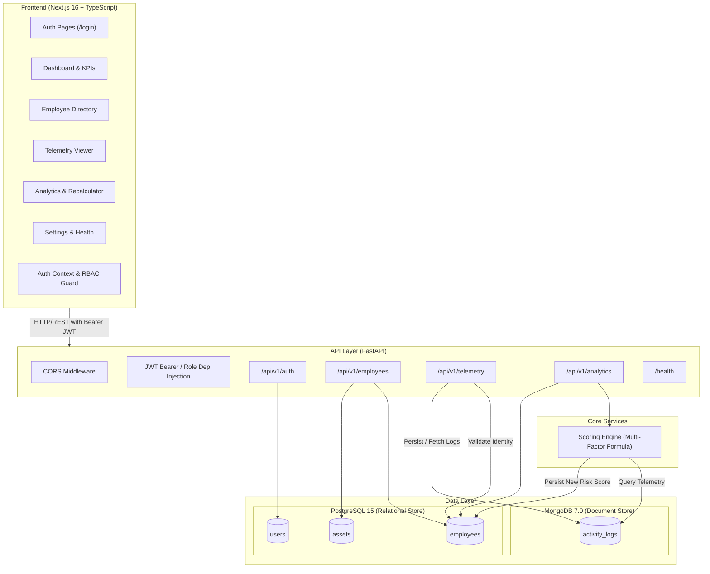

# ITBIS — Insider Threat Behavioral Intelligence System

[](https://fastapi.tiangolo.com/)
[](https://nextjs.org/)
[](https://www.postgresql.org/)
[](https://www.mongodb.com/)
[](https://tailwindcss.com/)
[](https://www.typescriptlang.org/)
[](https://www.python.org/)

An enterprise-grade, full-stack cybersecurity platform designed to detect, track, and analyze insider threat behavioral risks across organizational identities, endpoints, and telemetry events in real time.

---

## 1. Project Objective

Modern security operations centers (SOCs) face escalating risks from unauthorized internal access, credential misuse, and data exfiltration. **ITBIS** solves this challenge by unifying:
- **Relational Identity Management**: Centralizing employee identity metadata, hardware asset tracking, and role-based privilege tiers in PostgreSQL.
- **High-Throughput Telemetry Ingestion**: Capturing unstructured behavioral event logs (file access, downloads, privilege modifications, remote logins) in MongoDB.
- **Dynamic Threat Scoring**: Evaluating cross-factor behavioral anomaly models to assign quantifiable risk scores and categorize employees into real-time threat bands (`LOW`, `MEDIUM`, `HIGH`, `CRITICAL`).
- **Granular Role-Based Access Control (RBAC)**: Enforcing strict least-privilege access across the UI and REST APIs for Analysts, SOC Engineers, Managers, and Administrators.

---

## 2. Key Features Currently Implemented

- **Unified Dual-Database Architecture**:
  - PostgreSQL for relational user credentials, employee identity records, and linked assets.
  - MongoDB for high-velocity, flexible JSON telemetry logs and audit trails.
- **Authentication & RBAC**:
  - OAuth2 Password Bearer flow with HS256 JWT access tokens.
  - Bcrypt password hashing and session expiry management.
  - 4 strict system roles: `ADMINISTRATOR`, `SECURITY_MANAGER`, `SOC_ENGINEER`, `SECURITY_ANALYST`.
  - Granular API route protection and dynamic frontend capability guards.
- **Employee Identity & Asset Tracking**:
  - Employee profile management (Name, Department, Designation, Manager, Access Level).
  - Primary hardware footprint tracking (`device_id`, `ip_address`, `os_type`).
  - One-to-many corporate asset registration (`DEVICE`, `IP` with MAC address tracking).
  - Server-side pagination, search, and department/risk-band filtering.
- **Telemetry Ingestion Engine**:
  - REST endpoint (`/api/v1/telemetry/ingest`) for ingesting behavioral logs.
  - Foreign key verification against existing PostgreSQL identities before persisting logs.
  - Categorized event indexing (`LOGIN`, `FILE_DOWNLOAD`, `FILE_UPLOAD`, `DATA_TRANSFER`, `EMAIL_ACTIVITY`, `PRIVILEGE_CHANGE`, `REMOTE_ACCESS`).
  - Per-employee historical log retrieval sorted by timestamp descending.
  - Server-Sent Events live stream at `/api/v1/telemetry/stream` (Telemetry page updates without refresh).
  - Optional generator: `python scripts/live_log_streamer.py` posts mixed benign/anomaly logs every 2 seconds.
- **Incident & Alert Management**:
  - REST list/get/create, status transitions (`NEW`, `UNDER_INVESTIGATION`, `RESOLVED`, `FALSE_POSITIVE`), analyst assignment, and case notes.
  - Auto-incident trigger when ML/ingest threat score exceeds 75 (HIGH/CRITICAL upsert).
  - Isolate User Access containment action (privilege reduction + audit note).
  - Investigation drawer: chronological timeline, Z-score factors, Escalate / False Positive / Isolate.
- **Reports & Export**:
  - Executive JSON summary plus CSV / PDF downloads for security-manager reporting.
- **Risk Scoring & Analytics Engine**:
  - Rule-based multi-factor weighted scoring service.
  - Fleet-wide threat aggregation: high-risk counts, critical counts, fleet average score (0–100), risk band distribution, and department-level threat rankings.
  - On-demand single-employee risk recalculation with full factor breakdown auditing.
- **Enterprise Dark-Themed Next.js Dashboard**:
  - Executive Overview Dashboard with real-time KPI cards and score distribution gauges.
  - Employee Identity Directory with deep profile drawers and asset association.
  - Telemetry Stream Viewer with live SSE updates, JSON payload inspectors, and severity badges.
  - Incidents & Alerts queue with investigation drawer.
  - Reports & Export page (CSV / PDF).
  - Advanced Analytics page with interactive department risk breakdown and on-demand threat recalculator.
  - System Settings & Health page with connection diagnostics, scoring weights, and RBAC matrix inspector.

---

## 3. Technology Stack

### Frontend
- **Framework**: [Next.js 16](https://nextjs.org/) (App Router, React 19, Server & Client Components)
- **Language**: [TypeScript 5](https://www.typescriptlang.org/)
- **Styling**: [TailwindCSS v4](https://tailwindcss.com/) with custom dark SOC design system
- **HTTP Client**: [Axios](https://axios-http.com/) with Bearer token interceptors and automatic 401 redirect handling
- **Icons**: [Lucide React](https://lucide.dev/)

### Backend
- **Framework**: [FastAPI](https://fastapi.tiangolo.com/) (Python 3.11+)
- **Server**: [Uvicorn](https://www.uvicorn.org/) (ASGI)
- **Data Validation & Settings**: [Pydantic v2](https://docs.pydantic.dev/) & `pydantic-settings`
- **Database ORM**: [SQLAlchemy 2.0](https://www.sqlalchemy.org/)
- **Async Mongo Driver**: [Motor](https://motor.readthedocs.io/) / [PyMongo](https://pymongo.readthedocs.io/)

### Databases & Storage
- **PostgreSQL 15**: Primary relational store for platform users, employee profiles, access tiers, and hardware assets.
- **MongoDB 7.0**: Document store for raw behavioral telemetry events (`activity_logs` collection).

### Authentication & Security
- **JWT**: `python-jose[cryptography]` (HMAC-SHA256 token encoding/decoding)
- **Password Hashing**: `passlib[bcrypt]` / `bcrypt`
- **CORS Middleware**: Configured for local Next.js and Vite development servers

---

## 4. High-Level Project Architecture



---

## 5. Current Project Structure

```text
ITBIS_project/
├── backend/
│   ├── app/
│   │   ├── api/
│   │   │   ├── v1/
│   │   │   │   ├── endpoints/
│   │   │   │   │   ├── __init__.py
│   │   │   │   │   └── analytics.py       # Risk summary & on-demand recalculation endpoints
│   │   │   │   ├── __init__.py
│   │   │   │   ├── auth.py                # Register, OAuth2 login, /me endpoint
│   │   │   │   ├── employees.py           # Employee CRUD, list/filter, asset linkage
│   │   │   │   └── telemetry.py           # Behavioral log ingestion & log query
│   │   │   ├── deps.py                    # Database session & RBAC dependency providers
│   │   │   └── __init__.py
│   │   ├── core/
│   │   │   ├── config.py                  # Pydantic BaseSettings (.env reader)
│   │   │   ├── security.py                # Passlib bcrypt hashing & JWT token generators
│   │   │   └── __init__.py
│   │   ├── db/
│   │   │   ├── init_db.py                 # Table initialization helper
│   │   │   ├── mongo.py                   # Async Motor client lifecycle & db provider
│   │   │   └── session.py                 # SQLAlchemy engine & sessionmaker
│   │   ├── models/
│   │   │   └── domain.py                  # SQLAlchemy models: User, Employee, Asset, Enums
│   │   ├── schemas/
│   │   │   └── schemas.py                 # Pydantic request/response schemas
│   │   ├── services/
│   │   │   └── scoring.py                 # 4-factor risk scoring engine algorithm
│   │   ├── __init__.py
│   │   └── main.py                        # FastAPI entry point, lifespan, CORS, routers
│   ├── .dockerignore
│   ├── .env.example                       # Safe backend environment variable template
│   ├── .gitignore
│   ├── backfill_employee_fields.py        # Database field backfill utility
│   ├── Dockerfile                         # Python FastAPI container definition
│   ├── migrate_add_employee_columns.py    # Schema column migration script
│   ├── milestone1_verify.py               # Comprehensive 4-pillar automated test suite
│   ├── requirements.txt                   # Backend Python dependencies
│   ├── seed_data.py                       # Idempotent DB seeding script (users, emps, logs)
│   └── verify_api.py                      # Quick smoke test script
├── frontend/
│   ├── public/                            # Static SVG icons and assets
│   │   ├── file.svg
│   │   ├── globe.svg
│   │   ├── next.svg
│   │   ├── vercel.svg
│   │   └── window.svg
│   ├── src/
│   │   ├── app/
│   │   │   ├── (auth)/
│   │   │   │   ├── layout.tsx             # Auth layout wrapper
│   │   │   │   └── login/
│   │   │   │       └── page.tsx           # Interactive role-switcher login page
│   │   │   ├── (dashboard)/
│   │   │   │   ├── analytics/
│   │   │   │   │   └── page.tsx           # Department metrics & recalculation console
│   │   │   │   ├── dashboard/
│   │   │   │   │   ├── error.tsx          # Error boundary
│   │   │   │   │   ├── loading.tsx        # Skeleton loaders
│   │   │   │   │   └── page.tsx           # Executive overview & fleet telemetry summary
│   │   │   │   ├── employees/
│   │   │   │   │   └── page.tsx           # Employee grid, search/filter, drawer, onboarding
│   │   │   │   ├── settings/
│   │   │   │   │   └── page.tsx           # System health, scoring config, RBAC guide
│   │   │   │   ├── telemetry/
│   │   │   │   │   └── page.tsx           # Live activity log stream & manual log injector
│   │   │   │   └── layout.tsx             # Dashboard wrapper with Sidebar & TopBar
│   │   │   ├── favicon.ico                # Application favicon
│   │   │   ├── globals.css                # TailwindCSS v4 imports & styling tokens
│   │   │   ├── layout.tsx                 # Root layout & AuthProvider wrapper
│   │   │   └── page.tsx                   # Root redirect handler to /dashboard
│   │   ├── components/
│   │   │   ├── dashboard/
│   │   │   │   ├── RecentAlertsTable.tsx  # High/Critical alert quick-view table
│   │   │   │   ├── RiskScoreGauge.tsx     # Circular/visual threat score gauge
│   │   │   │   └── ThreatOverviewCards.tsx# Executive KPI cards
│   │   │   └── layout/
│   │   │       ├── DashboardShell.tsx     # Responsive layout container
│   │   │       ├── Header.tsx             # Supplementary header component
│   │   │       ├── Sidebar.tsx            # Navigation sidebar with permission gating
│   │   │       └── TopBar.tsx             # User profile, role badge, session logout
│   │   ├── lib/
│   │   │   └── rbac.ts                    # Frontend role-to-permission mapping helpers
│   │   ├── services/
│   │   │   └── api.ts                     # Axios client & typed API service methods
│   │   └── types/
│   │       └── api.ts                     # TypeScript interfaces matching backend schemas
│   ├── .dockerignore
│   ├── .gitignore
│   ├── AGENTS.md                          # Next.js 16 AI developer guidance
│   ├── CLAUDE.md                          # Assistant context configuration
│   ├── Dockerfile                         # Next.js multi-stage production container
│   ├── eslint.config.mjs                  # ESLint configuration
│   ├── next.config.ts                     # Next.js 16 configuration
│   ├── package.json                       # Frontend dependencies & scripts
│   ├── postcss.config.mjs                 # PostCSS configuration for TailwindCSS v4
│   ├── README.md                          # Frontend documentation
│   └── tsconfig.json                      # TypeScript configuration
├── .cursorrules                           # Cursor AI coding rules and standards
├── .gitignore
├── docker-compose.yml                     # Multi-container orchestration (Postgres, Mongo, Backend, Frontend)
├── requirements.txt                       # Root Python dependencies reference
├── AGENTS.md                              # Project-wide AI developer guide and standards
└── README.md                              # Main project documentation
```

---

## 6. Authentication and RBAC Overview

ITBIS implements strict Role-Based Access Control across all backend endpoints and frontend interfaces.

### Role Hierarchy & Capabilities

| Role | Description | Manage Employees | Ingest/View Telemetry | View Analytics | View API Docs | Manage Settings |
| :--- | :--- | :---: | :---: | :---: | :---: | :---: |
| **`ADMINISTRATOR`** | Full root access to all data, scoring rules, docs, and configurations | **Yes** | **Yes** | **Yes** | **Yes** | **Yes** |
| **`SECURITY_MANAGER`** | Supervisory role focused on employee risk profiles and fleet posture | **Yes** | **Yes** | **Yes** | No | No |
| **`SOC_ENGINEER`** | Technical incident response, log investigation, and API inspection | No | **Yes** | **Yes** | **Yes** | No |
| **`SECURITY_ANALYST`** | Least-privilege operational view for monitoring events and alerts | No | **Yes** (View) | **Yes** (View) | No | No |

### How It Works
1. **Login Request**: User submits credentials via standard OAuth2 password form (`POST /api/v1/auth/login`).
2. **Password Verification**: Backend validates bcrypt-hashed passwords in PostgreSQL.
3. **JWT Issuance**: An encoded token containing claims (`sub`, `user_id`, `role`, `exp`) is returned.
4. **Endpoint Enforcement**: Backend routes use FastAPI dependencies `get_current_active_user` and `require_roles([...])` to reject unauthorized requests with `401 Unauthorized` or `403 Forbidden`.
5. **Frontend Enforcement**: The frontend client reads user permissions via `src/lib/rbac.ts` to conditionally render navigation items, action buttons, and modal dialogs.

---

## 7. Employee Identity & Activity Log Functionality

### Monitored Employee Identity (PostgreSQL)
Each monitored identity stores:
- **Core Identity**: Employee ID (`emp_id`), First & Last Name, Department, Designation, Manager Name.
- **Hardware & Network Footprint**: Assigned `device_id` (e.g., `ASSET-LT-1001`), `ip_address` (IPv4/IPv6), and `os_type` (e.g., `Windows 11 Enterprise`, `macOS Sonoma`, `Ubuntu 22.04`).
- **Access Privilege Level**: `READ`, `WRITE`, or `ADMIN`.
- **Computed Threat State**: Normalized `risk_score` (`0.0` to `1.0`) and derived `risk_category` (`LOW`, `MEDIUM`, `HIGH`, `CRITICAL`).
- **Associated Assets**: One-to-many relationship with `assets` table tracking additional IP/Device endpoints and MAC addresses.

### Telemetry Logs (MongoDB)
Behavioral event documents in the `activity_logs` collection contain:
- `emp_id` & `employee_db_id`: Foreign link to PostgreSQL identity.
- `event_type`: Standardized event classification:
  - `LOGIN`
  - `FILE_DOWNLOAD`
  - `FILE_UPLOAD`
  - `DATA_TRANSFER`
  - `EMAIL_ACTIVITY`
  - `PRIVILEGE_CHANGE`
  - `REMOTE_ACCESS`
- `severity`: `CRITICAL`, `HIGH`, `MEDIUM`, `LOW`, or `INFO`.
- `source_ip`: IP address where the event originated.
- `payload`: Flexible JSON object containing contextual metadata (e.g., bytes transferred, target paths, protocol flags).
- `timestamp` & `ingested_at`: UTC event occurrence and database persistence timestamps.

---

## 8. Analytics & Risk Scoring Engine

The scoring engine (`backend/app/services/scoring.py`) calculates behavioral risk through a 4-factor weighted model evaluated over a configurable look-back window (default: 72 hours):

$$\text{Threat Score} = 100 \times \left( 0.35 \times W_{\text{anomaly}} + 0.25 \times F_{\text{freq}} + 0.25 \times C_{\text{asset}} + 0.15 \times S_{\text{severity}} \right)$$

### Scoring Factors

1. **Anomaly Weight ($W_{\text{anomaly}}$, 35%)**: Evaluates the maximum risk weight among event types recorded (e.g., `PRIVILEGE_CHANGE` = 1.0, `DATA_TRANSFER` = 0.85, `FILE_UPLOAD` = 0.70, `LOGIN` = 0.20).
2. **Frequency Score ($F_{\text{freq}}$, 25%)**: Log-scaled evaluation of total event volume within the time window ($\min(1.0, \frac{\ln(N + 1)}{\ln(51)})$).
3. **Asset Criticality ($C_{\text{asset}}$, 25%)**: Evaluates risk exposure based on access privilege level (`ADMIN` = 1.0, `WRITE` = 0.6, `READ` = 0.2) and assigned asset counts.
4. **Historical Severity ($S_{\text{severity}}$, 15%)**: Mean severity weight across all captured events in the evaluation window.

### Risk Category Thresholds

| Risk Category | Threat Score Range (0–100) | Normalized Database Score (0.0–1.0) |
| :--- | :---: | :---: |
| **`CRITICAL`** | $\ge 80$ | $\ge 0.80$ |
| **`HIGH`** | $60 - 79.99$ | $0.60 - 0.79$ |
| **`MEDIUM`** | $30 - 59.99$ | $0.30 - 0.59$ |
| **`LOW`** | $< 30$ | $< 0.30$ |

---

## 9. Database Setup

ITBIS uses dual persistence engines.

### Relational Schema (PostgreSQL)
Initialized automatically by `init_db()` on backend startup:
- `users`: Platform operators with role assignments and hashed credentials.
- `employees`: Monitored corporate identities with risk bands and primary device properties.
- `assets`: Corporate devices/IPs attached to employees.

### Document Store (MongoDB)
- Database: `itbis_logs`
- Collection: `activity_logs`
- Indexes: `emp_id` and `timestamp` descending for fast telemetry retrieval and scoring queries.

---

## 10. Environment Variable Setup

> [!IMPORTANT]
> **Security Notice**: Never commit your active `.env` file to version control. Keep `.env` strictly local.

### Backend `.env` Configuration
Copy the provided `.env.example` template into `backend/.env`:

```bash
cp backend/.env.example backend/.env
```

Set the configuration variables in `backend/.env`:

```env
# ============================================================
# ITBIS — Backend Environment Variables
# ============================================================

# ── PostgreSQL (Primary relational database) ──────────────────
# Format: postgresql+psycopg2://<user>:<password>@<host>:<port>/<dbname>
# For local SQLite testing, you can also use: sqlite:///./sql_app.db
DATABASE_URL=postgresql+psycopg2://<your-postgres-user>:<your-postgres-password>@localhost:5432/<your-db-name>

# ── MongoDB (Behavioural log & event store) ───────────────────
MONGO_URI=mongodb://localhost:27017
MONGO_DB_NAME=itbis_logs

# ── JWT Authentication ─────────────────────────────────────────
# Generate a secure key: openssl rand -hex 32
SECRET_KEY=<your-generated-256-bit-secret-key>
ALGORITHM=HS256
ACCESS_TOKEN_EXPIRE_MINUTES=60

# ── Application ────────────────────────────────────────────────
APP_NAME=ITBIS
DEBUG=False
```

### Frontend `.env.local` Configuration (Optional)
If running outside default localhost ports, create `frontend/.env.local`:

```env
NEXT_PUBLIC_API_URL=http://localhost:8000
```

---

## 11. Local Development Setup

### Prerequisites
- Python 3.11+
- Node.js 20+ and npm 10+
- PostgreSQL 15+ running locally (or SQLite fallback)
- MongoDB 7.0+ running locally
- *(Alternative)* Docker & Docker Compose

---

### Option A: Manual Setup (Recommended for Step-by-Step Development)

#### 1. Start Backend

```bash
# Navigate to backend directory
cd backend

# Create and activate a virtual environment
# On Linux / macOS:
python3 -m venv venv
source venv/bin/activate

# On Windows (PowerShell):
python -m venv venv
.\venv\Scripts\Activate.ps1

# Install dependencies
pip install -r requirements.txt

# Run database seed script (Seeds 4 role users, 15 employees, ~150 telemetry logs)
python seed_data.py

# Start the FastAPI development server
uvicorn app.main:app --reload --host 127.0.0.1 --port 8000
```

In a third terminal, stream live logs (every 2 seconds):

```bash
python scripts/live_log_streamer.py
```

Backend will be accessible at:
- **API Base**: `http://127.0.0.1:8000`
- **Interactive Swagger Docs**: `http://127.0.0.1:8000/api/docs`
- **ReDoc**: `http://127.0.0.1:8000/api/redoc`

#### 2. Start Frontend

Open a new terminal window:

```bash
# Navigate to frontend directory
cd frontend

# Install Node dependencies
npm install

# Start Next.js development server
npm run dev
```

Frontend will be accessible at:
- **Web UI**: `http://localhost:3000`

---

### Option B: Docker Compose Setup

Run the complete multi-service stack (Postgres, Mongo, Backend, Frontend) with a single command:

```bash
# Build and run containers in attached mode
docker compose up --build

# Or run in background (detached mode)
docker compose up -d

# Stop and remove containers and volumes
docker compose down -v
```

Empty databases are seeded automatically on first backend container start (`seed_data.py` when no users exist). Uvicorn runs a **single worker** so SSE clients share the in-process telemetry broker.

### End-to-end demo flow

1. Open `http://localhost:3000` and sign in as `soc@itbis.internal` / `SocEng123!`.
2. Open **Telemetry Logs**. Confirm the SSE badge shows live.
3. In a second terminal: `python scripts/live_log_streamer.py` (API must be on port 8000).
4. Watch new rows appear without refreshing. High scores auto-open **Incidents & Alerts**.
5. Click an incident (or a high-risk employee card on the Dashboard) to open the investigation drawer: timeline, Z-score factors, **Escalate**, **Mark False Positive**, **Isolate User Access**, case notes.
6. Open **Reports & Export** and download CSV / PDF for the executive briefing.

---

## 12. Pre-Seeded Demonstration Accounts

When running `python seed_data.py` or launching via demo containers, the following four accounts are seeded:

| Role | Email | Password | Intended Use Case |
| :--- | :--- | :--- | :--- |
| **`ADMINISTRATOR`** | `admin@itbis.internal` | `Admin1234!` | Full system administration, RBAC viewing, API docs |
| **`SECURITY_MANAGER`** | `manager@itbis.internal` | `Manager123!` | Employee identity oversight, asset linkage, analytics |
| **`SOC_ENGINEER`** | `soc@itbis.internal` | `SocEng123!` | Telemetry log investigation, API testing, technical docs |
| **`SECURITY_ANALYST`** | `analyst@itbis.internal` | `Analyst123!` | Read-only threat monitoring and alert inspection |

---

## 13. API Overview (Implemented Endpoints)

All `/api/v1/*` endpoints (except `/auth/login` and `/auth/register`) require an `Authorization: Bearer <token>` header.

### Health
- `GET /health` — Check backend service health status.

### Authentication & RBAC (`/api/v1/auth`)
- `POST /api/v1/auth/register` — Create a new platform user account.
- `POST /api/v1/auth/login` — Exchange OAuth2 credentials for a Bearer JWT token.
- `GET /api/v1/auth/me` — Retrieve the current authenticated user profile and assigned role.

### Employee Identity (`/api/v1/employees`)
- `GET /api/v1/employees/` — List employees with pagination (`skip`, `limit`) and filters (`department`, `risk_category`).
- `POST /api/v1/employees/` — Register a new monitored employee profile (*Requires `SECURITY_MANAGER` or `ADMINISTRATOR`*).
- `GET /api/v1/employees/{emp_id}` — Retrieve detailed profile and linked assets for a specific employee.
- `POST /api/v1/employees/{emp_id}/assets` — Associate a new Device/IP asset with an employee (*Requires `SECURITY_MANAGER` or `ADMINISTRATOR`*).

### Telemetry Ingestion & Logs (`/api/v1/telemetry`)
- `POST /api/v1/telemetry/ingest` — Validate `emp_id` against PostgreSQL, persist behavioral log to MongoDB, run ML scoring, auto-trigger incidents when score > 75.
- `GET /api/v1/telemetry/logs/{emp_id}` — Query recent MongoDB telemetry logs for a given employee (sorted descending).
- `GET /api/v1/telemetry/stream` — Server-Sent Events feed of newly ingested logs (`Authorization` header or `token` query).

### Analytics & Risk Scoring (`/api/v1/analytics`)
- `GET /api/v1/analytics/summary` — Retrieve aggregated fleet posture, high-risk counts, average threat score, category distribution, and department rankings.
- `POST /api/v1/analytics/calculate-risk` — Trigger an on-demand multi-factor risk recalculation for an employee over a look-back window and persist updated scores.

### Incidents (`/api/v1/incidents`)
- `GET /api/v1/incidents/` — List incidents (`status`, `severity`, `emp_id`, pagination).
- `GET /api/v1/incidents/{id}` — Incident detail.
- `POST|PATCH /api/v1/incidents/{id}/status` — Status: `NEW` | `UNDER_INVESTIGATION` | `RESOLVED` | `FALSE_POSITIVE`.
- `POST|PATCH /api/v1/incidents/{id}/assign` — Assign to an analyst.
- `POST /api/v1/incidents/{id}/comments` — Add analyst notes.
- `POST /api/v1/incidents/{id}/isolate` — Isolate subject access.
- `GET /api/v1/incidents/{id}/timeline` — Chronological telemetry.
- `GET /api/v1/incidents/{id}/risk-factors` — Z-score attribution.

### Reports (`/api/v1/reports`)
- `GET /api/v1/reports/executive-summary` — JSON executive threat summary.
- `GET /api/v1/reports/export?format=csv|pdf` — Compliance export download.

---

## 14. Testing & Verification

The project includes automated verification suites located in the `backend/` directory.

### Running Automated Milestone Verification
Ensure the backend server is running on `http://127.0.0.1:8000`, then run:

```bash
cd backend
python milestone1_verify.py
```

This automated test script validates:
1. **Authentication Pillar**: Login flows for all 4 RBAC roles, token generation, invalid credential rejection, and `/auth/me` inspection.
2. **Employee Identity Pillar**: Employee listing, pagination limits, department filtering, risk band filtering, and device attribute presence (`device_id`, `ip_address`, `os_type`, `access_level`).
3. **Telemetry Pillar**: MongoDB connection status, log retrieval by `emp_id`, and event structure validity.
4. **Analytics Pillar**: `/analytics/summary` calculation consistency, score ranges (0–100), risk band distribution summing, and department breakdown metrics.

### Running Quick API Smoke Test
```bash
cd backend
python verify_api.py
```

---

## 15. Current Project Status (Milestones 1–4)

| Deliverable Component | Status | Implementation Details |
| :--- | :---: | :--- |
| **Relational Data Model & PostgreSQL** | `COMPLETED` | Users, Employees, Assets, Access Levels, Device fields, Incidents |
| **Document Store & MongoDB** | `COMPLETED` | `activity_logs` collection, async Motor integration |
| **Authentication & RBAC** | `COMPLETED` | JWT tokens, Bcrypt, 4 distinct roles, route guards |
| **Employee Management APIs** | `COMPLETED` | CRUD, filters, pagination, asset association |
| **Telemetry Ingestion APIs** | `COMPLETED` | Foreign-key validated ingestion, historical query, SSE stream |
| **Multi-Factor Risk Scoring Engine** | `COMPLETED` | 4-factor weighted threat model, Isolation Forest, on-demand recalculation |
| **Incident investigation** | `COMPLETED` | Auto-trigger >75, drawer timeline, notes, isolate, Z-score factors |
| **Reports & Docker stack** | `COMPLETED` | CSV/PDF export, compose stack (API, UI, Postgres, Mongo) |
| **Modern SOC Web Dashboard** | `COMPLETED` | Next.js 16 app with Dashboard, Directory, Telemetry, Incidents, Reports, Analytics, Settings |
| **Verification & Seed Data Suites** | `COMPLETED` | Idempotent seeder and automated test script |

---

## 16. Future Scope (Planned / Not Yet Implemented)

The following features represent upcoming roadmap items beyond the four delivery milestones:
- [ ] **SIEM / Syslog Ingestion Pipeline**: Native Kafka / Syslog forwarder connectors for enterprise log collectors (Splunk, Elastic, Sentinel).
- [ ] **External alerting**: Slack / Teams / PagerDuty webhooks for CRITICAL band transitions.

---

## 17. License & Guidelines

This project is built for security intelligence and insider threat behavioral research. Ensure all telemetry data ingestion complies with organizational privacy policies and local data protection regulations.