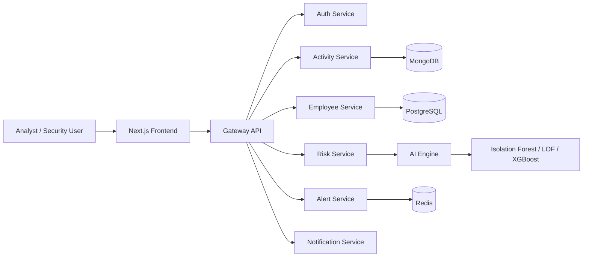

# Architecture Diagram

The architecture is separated into a frontend experience, a gateway for API composition, and discrete operational services for activity, intelligence, and notification handling.

