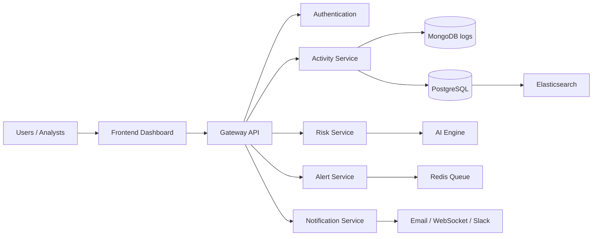

# SentinelAI Architecture Overview

## Why this architecture is needed

A cybersecurity platform is not a simple CRUD app. It must ingest large volumes of telemetry, normalize heterogeneous events, compute risk from context, and surface analyst workflows without losing traceability. A modular architecture keeps these concerns independent and allows each subsystem to scale on its own.

## Cybersecurity concept

The platform follows a defense-in-depth model:

- Activity telemetry enters through ingestion boundaries.
- Baselines are built from employee behavior patterns.
- Anomaly detection identifies deviations that may indicate misuse.
- Risk scoring ranks the severity.
- Alerts and investigation workflows provide analyst actionability.

## Software engineering concept

This system uses clean architecture boundaries:

- adapters for external systems
- domain/service logic for scoring and anomaly detection
- repository interfaces for persistent storage
- orchestration via API and message bus

## AI/ML concept

Behavioral baselines are created from historical activity patterns. UEBA then compares live activity against the baseline and peer groups to flag abnormal behavior.

## Enterprise usage

Security operations centers use this solution to continuously monitor employee activity, detect suspicious privilege abuse, and support insider-risk cases with evidence-backed timelines.

## Alternative approaches

A monolith could be simpler for a demo, but it becomes fragile as telemetry volume, policy rules, and model retraining evolve. A service-oriented layout is better aligned with enterprise security operations.

## Security considerations

All service-to-service traffic must be authenticated, rate-limited, and audited. Sensitive telemetry must be protected in transit and at rest. Every admin change should be versioned for audit purposes.

## High-level component view

