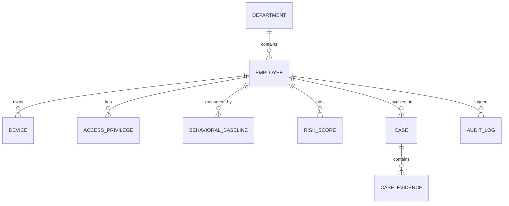

# Database Design

## Why separate PostgreSQL and MongoDB

PostgreSQL is the primary transactional system for relational entities such as employees, departments, devices, privilege assignments, cases, and analyst actions. MongoDB is optimized for append-heavy, semi-structured telemetry records such as login events, browser activity, file access traces, and raw event logs.

## PostgreSQL schema principles

The schema should be normalized to third normal form where practical. Entities are separated by real domain concern:

- `employees`
- `departments`
- `managers`
- `devices`
- `access_privileges`
- `behavioral_baselines`
- `risk_scores`
- `cases`
- `case_evidence`
- `audit_logs`
- `notifications`

## MongoDB usage

MongoDB is used for raw, high-cardinality activity logs that are frequently inserted and cheaply queried by event type, user ID, and time window.

## Entity relationship overview

## Security and governance notes

- Use row-level security or application-level access controls for sensitive HR data.
- Retain immutable audit history for all administrative changes.
- Use encrypted storage and secret key management for identities.
