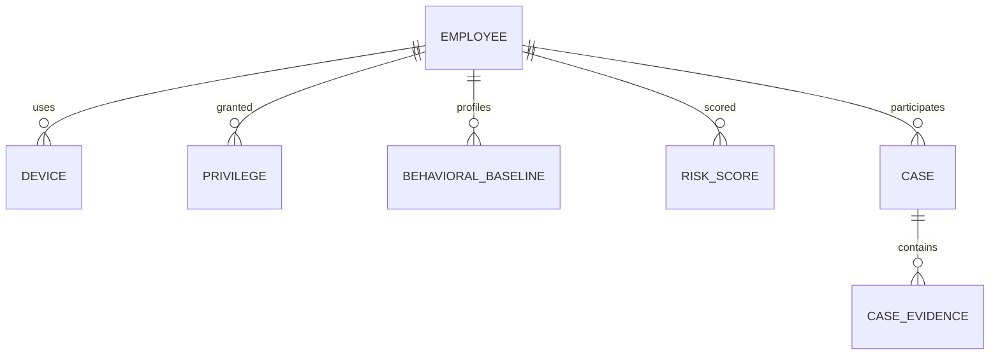

# Database Diagram

## PostgreSQL logical model

- `employees`
- `departments`
- `managers`
- `devices`
- `privileges`
- `behavioral_baselines`
- `risk_scores`
- `cases`
- `case_evidence`
- `audit_logs`

## MongoDB logical model

- `activity_events`
- `device_events`
- `file_access_events`
- `email_events`
- `vpn_events`

