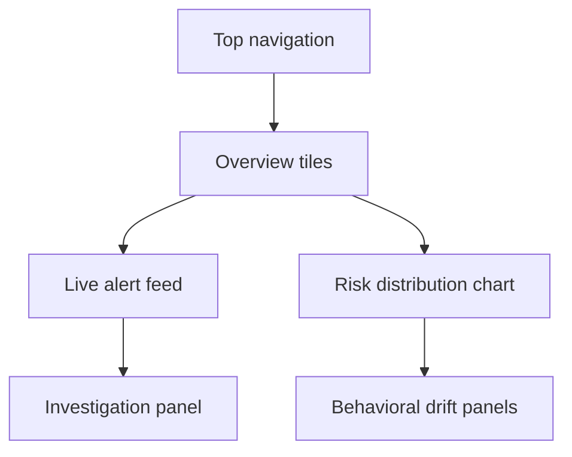

# UI Wireframes and Experience Design

## Design goals

The experience should feel like a modern enterprise security product: high contrast, responsive, glassy overlays, strong hierarchy, and analyst-first information density.

## Primary surfaces

1. Executive Dashboard
   - Risk KPIs
   - Department heat maps
   - Board-style overview

2. SOC Dashboard
   - Alert queue
   - Live incident stream
   - Investigation status

3. Risk Dashboard
   - Employee risk scores
   - Trend lines
   - Peer comparison

4. Behavior Dashboard
   - Baselines vs actual behavior
   - Outlier charts
   - Device and access patterns

5. Investigation Dashboard
   - Timeline
   - Evidence list
   - Case notes and correlation

6. Admin Dashboard
   - Role management
   - Policy tuning
   - Audit trail

## Wireframe concept

## Visual language

- Dark theme with steel-blue gradients
- Glass panels with subtle blur
- Motion only to highlight state transitions and alerts
- No heavy animation that reduces readability
